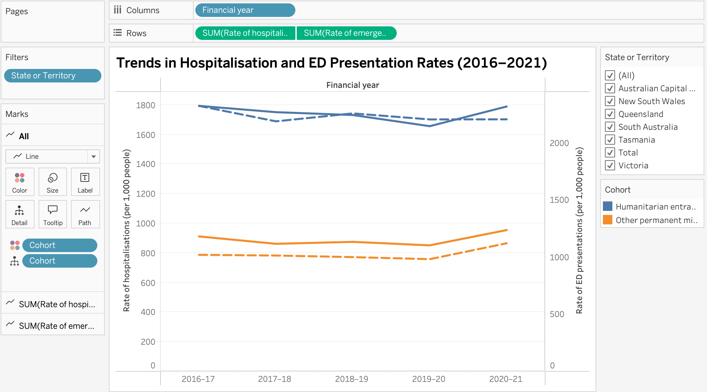
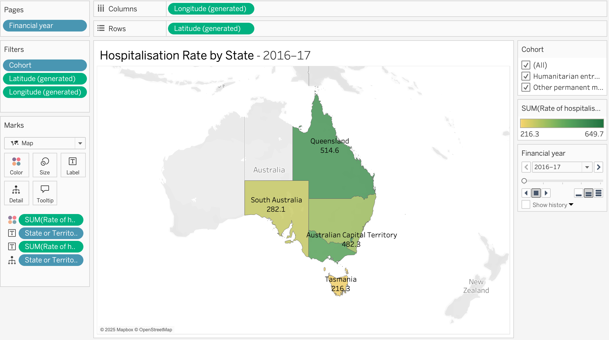
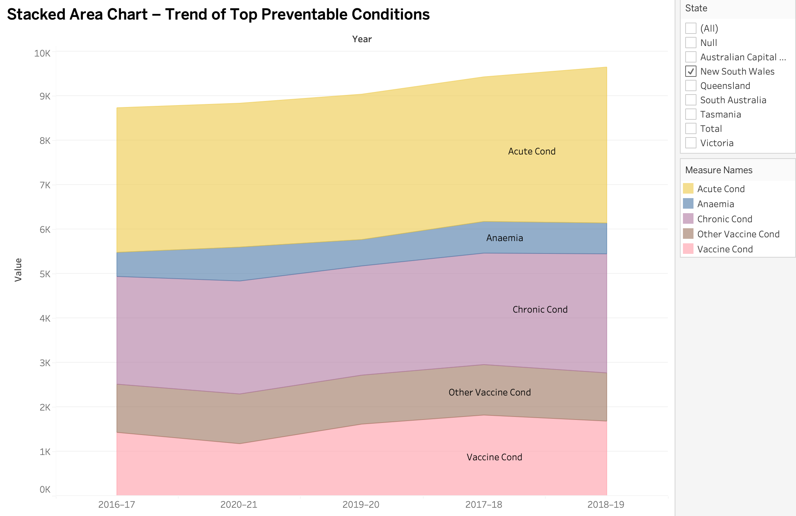

# Data Visualisation

This project presents a comprehensive visual analysis of Australian hospital data using advanced Tableau visualisation techniques. The aim was to identify trends, disparities, and insights from healthcare metrics across multiple cohorts, states, and years.

## Objectives

- Understand hospitalisation and emergency department (ED) trends across states.
- Compare arrival modes to ED facilities by region and cohort.
- Analyse patterns in potentially preventable hospitalisations (PPH).

## Data Sources

The data was sourced from the Australian Institute of Health and Welfare and spans the following datasets:

- **Table S4.1:** Hospitalisations and Emergency Department Presentations
- **Table S4.3:** ED Arrival Modes
- **Table S4.4:** Potentially Preventable Hospitalisations

## Visualisation Techniques

This portfolio uses a range of advanced visualisation techniques:

- **Dual-Axis Line Chart** – Compares hospitalisation vs ED presentation rates across time.
- **Choropleth Map** – Displays state-level variation in hospitalisation rates.
- **Proportional Pie Map** – Shows hospitalisation vs ED split scaled by population.
- **Stacked Bar Chart** – Visualises the mode of ED arrival by state and cohort.
- **Matrix Chart** – Compares condition-wise PPH counts across states and years.
- **Stacked Area Chart** – Tracks the trend of top 5 PPH conditions over time.

## Key Analytical Insights

- NSW and VIC show consistently higher hospitalisation rates than other states.
- Police-arranged ED arrivals are most prominent in NT and among refugee cohorts.
- ACT’s preventable hospitalisation rate exceeded the national average in 2019–20.
- Dental conditions and UTIs are consistently the most reported preventable conditions.

---

## 🖼️ Visual Preview

(images/2017-18.png)(images/2018-19.png)(images/2019-20.png)(images/2020-21.png)

